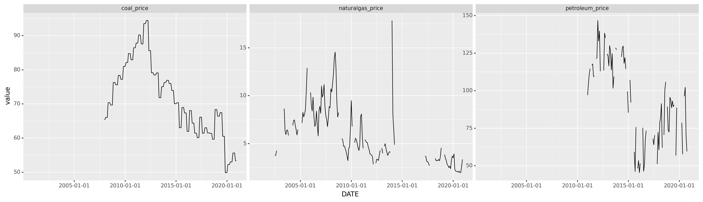

```{r, echo = FALSE}
library('bookdown')
```

# Introduction

Like in any other competitive market, the price of electricity is subject to several volatile factors such as the amount of generation, the prices of fossil fuels that are the source of electricity generation etc. In addition, it also manifests autocorrelation since it is highly correlated with its previous self. Thus, predicting electricity price is extremely hard, if not impossible. However, a reliable prediction of electricity price has multiple important implications to civilian life and industrial production. The purpose of this project is to build a predictive model of electricity price with selected features and to investigate which features are the most important ones while generating a prediction.

This report is divided into five parts. In the first part of the report, I give the background of the topic. Next is the data selection and wrangling process. In this part, I would state the rationale behind the choices for data and process of data wangling and merging. The third part is the analysis. In this part, I specified the method of dealing with missing values, performed initial data exploration, and selected certain modeling techniques. What follows are the last two parts of results and discussion, in which I analyzed model's performance, insights yielded from the model and actions that I might take if given more time.

# Background

Electricity price prediction has always been hard since it resembles fluctuation in the financial market, in which autocorrelation is not unusual. It is not only subject to supply and demand, but also to many other factors such as weather, the price of its raw material, different regulation, and different rules for market participation. A reliable prediction of electricity price can help people, businesses, and power plants to plan, avoid unnecessary cost and maximize output. Despite the hardships in predicting the price of electricity, many scholars have given their try in this endeavor. The most frequent methods adopted in the prediction is using hybrid models in which both times series and other types of models are employed to tackle this problem.(Najeh Chaâbane, 2014) Chaâbane combined the ARFIMA model and the neural networks model to take the strength of both model in generating results. LSTM (Long short-term memory) which is a subcategory of recurrent neural networks, is also commonly used in the case of predicting electricity price. Chang, Zhang, and Chen based their prediction on LSTM starting using Wavelet transform to decompose the price data.(Zihan Chang and Yang Zhang and Wenbo Chen, 2019) Then Adam is employed as the optimizer. In all, the research to date mostly employed neural networks with time series techniques to make the prediction. And the accuracy generally fades as the prediction spans into the future.

# Data

The data employed in this project is mainly from Energy Information Administration (EIA) of the U.S. Department of Energy, National Centers for Environmental Information and Google Trends. Due to the differences in factors that affects electricity price across states and the availability of data, this project will focus on data and predicting electricity price in the state of Virginia on a monthly basis between 2001 to 2020.

### Energy

The bulk of variables are energy directed-related data. The average price of electricity per kilowatt hour in cents through EIA is added to the data frame. Since in a competitive market, the price of a commodity is heavily related to the amount of supply, including the total amount of electricity generation is a sensible thing to do. The EIA provides the total quantity of electricity generated in megawatt hours in Virginia monthly. According to the EIA, there are five main source of energy that the electric power sector consumes: coal, natural gas, petroleum, renewable energy, and nuclear power. Three of the main are fossil fuels which are also subject to competitive market and volatile fluctuation. Including the monthly data amount of the consumption and price of those three types of fossil fuel will give the model more predictive power.

### Public Perception

Since the electricity market is a competitive market, people's perception towards electricity price could have effects on the price itself. Google trends data records the frequency and amount of google search of electricity price. It will lend insights into the extent of how people care about the electricity price in a certain period which could give the model some information regarding the demand of electricity. In addition, search trend can also reflect certain economical/political conjuncture that have huge impact on the electricity price. All in all, include search trends as an indicator of public perception will lend power to the model's prediction.

### Weather Conditions

Electricity consumption is subject to weather condition for reason that different weather may influence the amount that people consume. For instance, in hot or cold weather setting, people would be inclined to use more electricity to power the air conditioner to adjust the indoor temperature. In rainy day, people are also inclined to use more power to lower the humidity indoor. In both cases, the electricity consumption goes up due to unusual weather condition. And the consumption as demand will shape the price. Therefore, add indicators of weather will also provide vital information to the prediction. The monthly data of average temperature and average precipitation of Virginia are incorporated in the model. Both the data comes from National Centers for Environmental Information.

### Others

Other factors that are not directly related to the price of electricity but may have significant impact on it also need to be taken into consideration. The pandemic of COVID-19 reshapes many aspects of society, including how people interacted and perform their daily life. People in the covid era stayed home a lot more than before, which can increase their use of electronic appliance and boost up their consumption of electricity. Considering this, a dummy variable that takes the value of 1 after March 2020 and 0 before March 2020 can works as an indicator of the pandemic and provide that information to the model. What's more, like any other time series data, we can see from Figure 1 that the price of electricity demonstrates salient seasonality. Add a variable that reflects the seasonal change can capture the price fluctuation. After decomposing the price using package "statsmodels", a variable that depicts seasonal change can be extracted from the price and add to the data frame.
```{r decompose, fig.align = 'center', out.width = "75%", fig.cap = "Price of electricity after decomposition.",echo=FALSE}

```

### Data Wrangling Process

In terms of data wrangling, I first identify the target data within each single Excel sheet or csv file. Then I imported each raw data frame into python using pandas read\_ syntax. There are several Excel files that contain multiple sheets. Therefore, loops are necessary for import each sheet then concatenate them orderly. Next step would be changing every data frames' date into a uniformed format (Year-Month-Day) and selecting the target rows and columns. In the process, pivoting data frames from long to wide is involved in the fossil fuels consumption data. Since the variables chosen have the date of the month as index, after cleaning them, I joined them all together based on the date. Every unit of analysis contains the year/month date, the average price of electricity and other features that is correlated with the price.

# Analysis

There are mainly three components in my analysis of the data: Imputing the missing values, initial exploration through multiple visualizations and applying machine learning models.

### Imputing the missing values
```{r Unknown, fig.align = 'center', out.width = "75%", fig.cap = "Missing value of the data.",echo=FALSE}

```
From the miss matrix(Figure 2), there are quite a lot of missing values in variable coal_price, natrualgas_price and petroleum_price. Especially in variable petroleum_price, missing values almost comprised half of the sample size. Since my entire data frame only spans twenty years with pace of a month, it only contains 240 entries. I cannot afford to drop all rows that contain missing values for this action will greatly damage the continuity and integrity of the data. There are only two choices left: extrapolation/interpolation and imputing with regression predicted values. Based on the overall distribution of missing values, I chose imputing with regression predicted values. It is because when half of the variable values are missing leaving a large blank space with no data, the extrapolation process weighs a lot more in the imputing process(Figure 3). In this case, imputing with predicted values that is generated by learning from other variables seems viable. I used IterativeImputer from sklearn package to impute all the missing values. Using this methods, the empty spaces in the data frame would be filled with plausible values with no loss of entry.
```{r missing1, fig.align = 'center', out.width = "100%", fig.cap = "Missing value of fosssil fuel prices in line plot.",echo=FALSE}

```

### Data Exploration

I started my exploration process with discovering the correlation between selected features. (Figure 4). As the heatmap of correlation shows, the consumption of natural gas and coal are negatively correlated. It is not counter intuitive because within a period, when the total amount of generation is set, the consumption of the fossil fuels is like a tipping board, one end goes down the other one would go up. The same logic can be applied to the negative relations between natural gas consumption, the total generation and coal price, petroleum price. When the total amount of generation and the consumption of natural gas are increasing, due to the lack of demand, the coal price and the petroleum price will drop. What is interesting is the fact that public perception is highly correlated with the consumption of coal, the price of coal and the price of petroleum. One hypothesis I can come up with is when the prices of those fossil fuels experience volatile fluctuations, the electricity price will also be affected and change violently. At this point, the public's attention is drawn to the fluctuations of electricity prices. From the plot we can also see that there are some positive correlations between fossil fuel prices. This is not surprising because fossil fuel market as a whole could experience fluctuations due to numerous incidents. Putting possible explanations aside, highly correlated features could possibly damage the model's predictive power due to the limited information they can provide.
```{r heatmap, fig.align = 'center', out.width = "100%", fig.cap = "The correlation between features.",echo=FALSE}

```
Second, I plotted a histogram for all the continuous variables to see the distribution of each feature. (Figure 5) We can see that the consumption of natural gas, the consumption of petroleum, the petroleum price and Other gases consumption have salient one-sided skewed tendency. After logging them, the one-side skewed problems resolved except the variable other gases consumption. Since that variable have mostly zero as values, I decided to drop this feature for it contains little information.
```{r distribution, fig.align = 'center', out.width = "100%", fig.cap = "The histgrams of each feature,",echo=FALSE}

```
Third, I investigated the relationships between the electricity price and each feature. (Figure 6) In terms of the energy data, The consumption and price of coal and petroleum have the same downward sloping trend when plotted against electricity price. This makes sense because when the price of those two fuels falls, the electricity industry would utilize more fuels of those kind to generate power, which in all would bring down the price of unit electricity. What is counter intuitive is the relationships between natural gas and the price of electricity. The price of natural gas has a positive correlation with electricity price while its consumption has a negative relationship with electricity price. According to the EIA, natural gas accounts for half the energy consumed when generating electricity. One hypothesis would be when the natural gas price drops, the industry would still use more natural gas, but since natural gas consumption takes up half of the total consumption, the price of electricity would still go up due to the large amount of natural gas used. In terms of the data of weather conditions, the trends fit my expectations that when temperature and precipitation increase, the electricity price would also increase due to the boosted demand. As for other data, covid do lead to an increase in the price of electricity. And the public perception variable also demonstrated positive effect on the price of electricity.
```{r simplelm, fig.align = 'center', out.width = "100%", fig.cap = "The scatter plot of each feature against price of electricity.",echo=FALSE}

```
### Modeling

I applied five models that is suited for regression problems: the linear model, K-Nearest Neighbors, Decision Tree, Bagged regressors and Random Forests. Before running the models, I performed several high-level preprocessing techniques which are not suited for automation. First, I dropped the other gases variable due to its inability to provide information. Second, I logged three variables as discussed above to solve the lopsided problem.

After the high-level preprocessing, I first set up the cross validation with ten splits. Then I set up a pipeline to first preprocess the continuous variables using MinMaxScaler which can reduce the range of each variable without losing or distorting information. After that I specified the models mentioned above and set up the tuning parameters respectively in the search space. Later, I employ GridSearchCV and feed in the pipeline and specified model to search for the best performing model among them.

After finding the best performing model, I investigated its mean squared error and performed feature importance tests to interpret the results.

# Results

The best performing model is Random Forest Regressor with max depth of 5 and 100 estimators. The mean squared error on the test data set is 0.179. The R2 score on the test dataset is 0.882. (Figure 7) This model is performing good enough for late feature importance interpretation.
```{r r2, fig.align = 'center', out.width = "75%", fig.cap = "The R2 plot of the best model.",echo=FALSE}

```

I first conducted permutation for each feature for 25 times to yield a reliable result of feature importance. (Figure 8) As shown in the plot, the two most important features are the consumption of natural gas and coal. Public reception comes third but is smaller by 0.36 than the second important feature. The Covid variable and seasonal have no importance which implies they did not contribute information to the final prediction. In the realm of energy data, consumption of natural gas and coal contribute the most to the model, which is not surprising since in the correlation heatmap many variables are highly correlated with each other, especially with the prices of three fossil fuels. For weather data, both average temperature and average precipitation have a minimal contribution to the model. In this context, the fluctuation in weather conditions have less effect on prediction than energy related variables. What is worth mentioning is that the variable seasonality is completely useless in the model. My reason for bringing this variable in is to boost up the effect of seasonal change on the electricity price. My intuition about this would be to a degree, seasonal change is reflected by the change in the average temperature and average precipitation. Therefore, the two variables of weather absorbed all the effect of seasonal change on the electricity price. Public perception indeed has effect on the electricity price although its permutation importance is significantly lower than the first two important features. The covid variable has zero importance in permutation importance process, which I think attribute to the fact that there are not enough entries that have covid equals one. The number of months in the covid era is much smaller than those in the pre-covid times.
```{r featureimportance, fig.align = 'center', out.width = "75%", fig.cap = "Feature importance plot.",echo=FALSE}

```
Next, I plotted the partial dependency plots to see how exactly each variable contribute to the prediction. (Figure 9 & 10) As we can see from the plots, only two variable: consumption of natural gas and coal, have significant impact on prediction when themselves are changing. In the coal consumption plot, we can see that the price of electricity drops significantly once the consumption reaches a point, whereas the electricity price rises steadily when the consumption of natural gas grows. When plotting the interaction partial dependency, we can clearly see that when coal consumption is relatively high and consumption of natural gas is relatively low, the price of electricity is at a low position. As the consumption of natural gas grows and that of coal shrinks, electricity price is at a high position. And as the last two graphs shown, even though public perception comes third when calculating permutation importance, its effect on price prediction is still small compared to the consumption of natural gas and coal.
```{r pdp, fig.align = 'center', out.width = "100%", fig.cap = "The partial dependency plot",echo=FALSE}

```
```{r pdp2, fig.align = 'center', out.width = "75%", fig.cap = "The partial denpendency plot of combination of two features.",echo=FALSE}

```
# Discussion

My initial idea of success is to produce a predictive model based on clean data. I have achieved the goal in the sense that the data wrangling process and model prediction accuracy are not problematic. However, the model itself relies on a small number of features reflects that the initial feature selection process is unsuccessful. Regarding the fact that price of electricity is in the range of time series data, perhaps employing traditional machine learning methods is not appropriate. But I am convinced that there are ways to identify more useful features that are better than the one I created.

In the process of doing this project, I consider using time series related model such as ARIMA. However, it has little use in terms of interpreting the result. Therefore, I only adopted a few methods in working with time series data such as extract the seasonality pattern and trend. If I am given more time, I would probably choose another topic that is not related to time series. (Probably not supposed to say that). Realistically, I will select more features to feed in the model and do more research on time series models to see how to incorporate it into this process.

# References

---
nocite: '@*'
...
